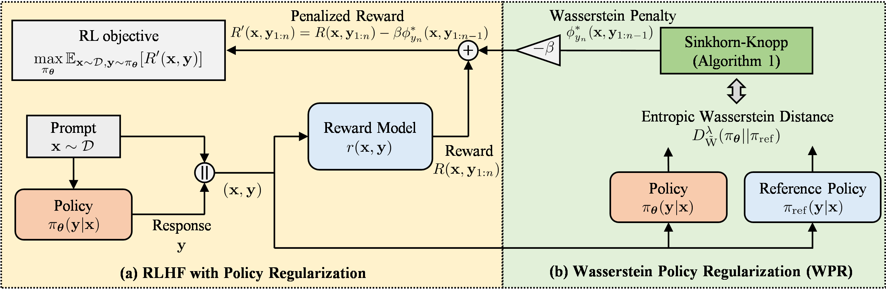

# Semantic-aware Wasserstein Policy Regularization for Large Language Model Alignment (WPR) (ICLR 2026)

--------------------

This repository contains the official implementation of **"Semantic-aware Wasserstein Policy Regularization for Large Language Model Alignment"** in **[ICLR 2026](https://iclr.cc/Conferences/2026)**.

**[Byeonghu Na](https://sites.google.com/view/byeonghu-na), [Hyungho Na](https://sites.google.com/view/asd-lab), [Yeongmin Kim](https://sites.google.com/view/yeongmin-space/), [Suhyeon Jo](https://aai.kaist.ac.kr/bbs/board.php?bo_table=sub2_1&wr_id=10), [HeeSun Bae](https://sites.google.com/view/baeheesun), [Mina Kang](https://aai.kaist.ac.kr/bbs/board.php?bo_table=sub2_1&wr_id=25), and [Il-Chul Moon](https://aai.kaist.ac.kr)**

**KAIST, UNIST, summary.ai**

--------------------

**Wasserstein Policy Regularization (WPR)** is a semantic-aware regularization for the reinforcement learning from human feedback (RLHF) framework based on the entropy-regularized Wasserstein distance, which incorporates the geometry of the token space.

--------------------

The code will be released soon. Please stay tuned!
